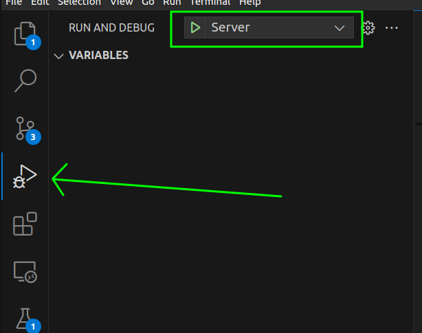

# TCP echo server

This project defines a template TCP server written in C++ using the [asio](https://think-async.com/Asio/) library for networking and [Gtest](https://github.com/google/googletest) for testing.

What you will find here:

- a working server accepting connections on a configurable port.
- a client system allowing to take actions when a client dis/connects and sends data.
- a working CI running the tests on each commit.
- a build process to package the server in a docker image.

This project was inspired by the server created in the [bsgalone](https://github.com/Knoblauchpilze/bsgalone) repository: the logic to play the game was not copied over and instead we kept a simple echo TCP server.

# Badges

[](https://github.com/Knoblauchpilze/tcp-server/actions/workflows/build-and-push.yml)

[](https://codecov.io/gh/Knoblauchpilze/tcp-server)

# Installation

⚠️ The following sections are tailored for an installation on Ubuntu: this is what was used during the development. If you want to try to install it on another OS it probably works but some of the command will need to be adapted.

If you do so, please consider contributing the guide as an issue to help fellow developers!

## Clone the repository

The first step (as is often the case) if you want to work on this project is to clone the repository with:

```bash
git clone git@github.com:Knoblauchpilze/tcp-server.git
# Move to the project's folder
cd tcp-server
```

## Install the asio library (Ubuntu)

This project uses the `asio` library for networking. There are two ways to install it: either using the version available in the packages. At the time of writing with Ubuntu 20.04 the packaged version is `1.18.1` which is quite old (2020). If you choose to do so, you can run:

```bash
apt-get install libasio-dev
```

You can also download the sources directly from the [official website](https://think-async.com/Asio/) (click on `Downloads`). This gives version `1.30.2` (at the time of writing).

**Note:** we used version `1.28` for the development.

The download process gives a `tar.bz2` file which can be extracted with (change the version as needed) and installed:

```bash
tar -xvjf asio-1.28.0.tar.bz2
sudo mkdir /usr/local/include/asio
sudo cp -r asio-1.28.0/include/* /usr/local/include/asio
```

You can remove the `Makefile.am` and `Makefile.in` files from this directory to not pollute the includes.

**Note:** in case you face problems to compile the project, you can take a look at the [Use asio](https://github.com/Knoblauchpilze/bsgalone?tab=readme-ov-file#use-the-library-in-the-project) section in the [bsgalone](https://github.com/Knoblauchpilze/bsgalone) project. Maybe this can help you.

## VScode configurations

### Extensions

In order to make it easy to debug and work on the project directly into the IDE, the following two extensions are recommended:

- [cmake-tools](https://marketplace.visualstudio.com/items?itemName=ms-vscode.cmake-tools).
- [test-mate](https://marketplace.visualstudio.com/items?itemName=matepek.vscode-catch2-test-adapter)

They will respectively help you build the project and debug/start it in your IDE and allow to run and debug tests.

The following sections assume that you installed both.

### Configuration for intellisense

In case you use VScode as an IDE to work on this project, it is recommended to create a `.vscode` folder at the root of the directory. You can then copy past the following configuration in a `c_cpp_properties.json` file:

```json
{
  "configurations": [
    {
      "name": "Linux",
      "includePath": [
        "${workspaceFolder}/**",
        "${workspaceFolder}/src/core",
        "/usr/local/include/",
        "/usr/local/include/asio"
      ],
      "defines": [],
      "compilerPath": "/usr/bin/g++",
      "cppStandard": "c++20",
      "intelliSenseMode": "linux-gcc-x64",
      "configurationProvider": "ms-vscode.cmake-tools"
    }
  ],
  "version": 4
}
```

Note that this will require you to have a local `g++` version supporting at least `c++20`.

### Configuration for CMake

The `cmake` tool extension allows to configure a custom build folder and to set arguments for the configure step. In this project we use conditional targets to build the tests: this is activated (as defined in the [Makefile](Makefile)) by the `ENABLE_TESTS` flag.

It is required to instruct the extension to use this flag when configuring the project so that it detects correctly all the target.

You can use the following configuration and paste it in the `.vscode` folder created above under `settings.json`:

```json
{
  "cmake.configureOnOpen": false,
  "cmake.buildDirectory": "${workspaceFolder}/cmake-build",
  "cmake.configureArgs": ["-DENABLE_TESTS=ON"],
  "testMate.cpp.discovery.gracePeriodForMissing": 500,
  "testMate.cpp.discovery.runtimeLimit": 500,
  "testMate.cpp.test.advancedExecutables": [
    {
      "pattern": "cmake-build/**/*{test,Test,TEST}*"
    }
  ],
  "C_Cpp.errorSquiggles": "enabled",
  "C_Cpp.default.compilerPath": "/usr/bin/g++"
}
```

### Launch/debug configuration

In order to run and debug the executable(s) created by the project you can use the following launch configuration: this will launch the server and allow to debug it if needed directly in the IDE.

```json
{
  "version": "0.2.0",
  "configurations": [
    {
      "name": "Server",
      "type": "cppdbg",
      "request": "launch",
      "program": "${workspaceFolder}/cmake-build/bin/server",
      "args": [],
      "stopAtEntry": false,
      "cwd": "${fileDirname}",
      "environment": [
        {
          "name": "PORT",
          "value": "5000"
        }
      ],
      "externalConsole": false,
      "MIMode": "gdb",
      "setupCommands": [
        {
          "description": "Enable pretty-printing for gdb",
          "text": "-enable-pretty-printing",
          "ignoreFailures": true
        },
        {
          "description": "Set Disassembly Flavor to Intel",
          "text": "-gdb-set disassembly-flavor intel",
          "ignoreFailures": true
        }
      ]
    }
  ]
}
```

This should allow you to pick the `Server` configuration win the `RUN AND DEBUG` tab:


